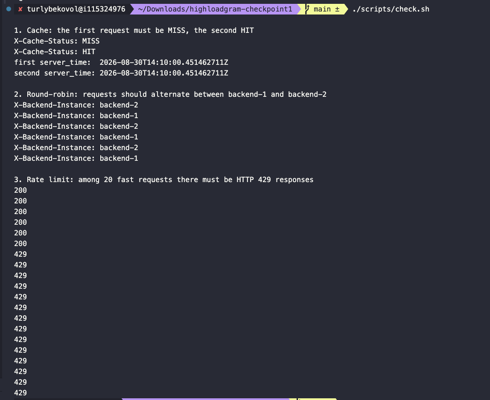
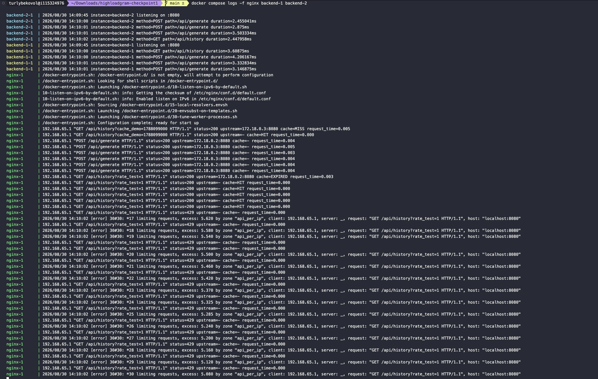

# HighloadGram

## Запуск

Через докер:
```bash
docker compose up --build -d
docker compose ps
```

Быстрая проверка ручек:
```bash
curl http://localhost:8080/api/history
curl -X POST -d 'bot_prefix=promo' http://localhost:8080/api/generate
```

Проверка трёх требований:
```bash
./scripts/check.sh
```

Запуск бенчмарков:
```bash
docker compose down
REQUEST_LOGS=false docker compose up --build -d

./scripts/benchmark.sh
```

Все логи:
```bash
docker compose logs -f nginx backend-1 backend-2
```

Остановка:
```bash
docker compose down
```

## Результаты нагрузочного тестирования

Результат каждого запуска оставил в папке `/results-saved`. Вот тут в виде таблицы:


### Каждый запуск

| Сценарий | Connections | RPS | Avg latency | p50 | p90 | p99 | Max latency | Timeouts |
|---|---:|---:|---:|---:|---:|---:|---:|---:|
| Direct GET `/api/history` | 10 | 396.79 | 20.14 ms | 20.10 ms | 21.23 ms | 22.84 ms | 47.73 ms | 0 |
| Direct POST `/api/generate` | 10 | 485.40 | 22.53 ms | 6.62 ms | 67.45 ms | 78.73 ms | 89.38 ms | 0 |
| NGINX POST `/api/generate` | 10 | 929.69 | 12.46 ms | 5.57 ms | 38.09 ms | 55.17 ms | 66.89 ms | 0 |
| NGINX cached GET `/api/history` | 10 | 494.10 | 16.17 ms | 15.89 ms | 21.43 ms | 27.15 ms | 39.95 ms | 0 |
| Direct GET `/api/history` | 100 | 398.76 | 271.11 ms | 239.12 ms | 553.54 ms | 973.34 ms | 1590 ms | 1 |
| Direct POST `/api/generate` | 100 | 463.20 | 233.80 ms | 210.48 ms | 488.24 ms | 813.17 ms | 1520 ms | 0 |
| NGINX POST `/api/generate` | 100 | 1010.95 | 122.03 ms | 89.17 ms | 288.83 ms | 491.57 ms | 889.56 ms | 0 |
| NGINX cached GET `/api/history` | 100 | 543.46 | 182.78 ms | 188.46 ms | 212.58 ms | 240.76 ms | 628.46 ms | 0 |
| Direct GET `/api/history` | 1000 | 347.98 | 1460 ms | 1620 ms | 1930 ms | 2000 ms | 2000 ms | 3810 |
| Direct POST `/api/generate` | 1000 | 441.34 | 296.85 ms | 168.60 ms | 798.38 ms | 1840 ms | 2000 ms | 1680 |
| NGINX POST `/api/generate` | 1000 | 997.61 | 225.98 ms | 94.97 ms | 580.13 ms | 1760 ms | 2000 ms | 2058 |
| NGINX cached GET `/api/history` | 1000 | 552.66 | 1260 ms | 1290 ms | 1670 ms | 1840 ms | 2000 ms | 393 |

### Сравнение производительности

| Connections | Direct POST RPS | NGINX POST RPS | Прирост POST | Direct GET RPS | NGINX cached GET RPS | Прирост GET |
|---:|---:|---:|---:|---:|---:|---:|
| 10 | 485.40 | 929.69 | +91.5% | 396.79 | 494.10 | +24.5% |
| 100 | 463.20 | 1010.95 | +118.3% | 398.76 | 543.46 | +36.3% |
| 1000 | 441.34 | 997.61 | +126.0% | 347.98 | 552.66 | +58.8% |

### Вывод

Для POST запросов при NGINX ожидаемые x2 к пропускной способности за счет работы двух бэкендов. Из интересного, обязательно нужно было ограничить по CPU каждый бэкенд для такого результата, иначе один контейнер мог забрать ресурсы за двоих. Также чтобы не упереться в диск было решено отключать логирование при бенчмарках.

По GET ситуация интереснее из-за не сильного улучшения времени. В основном это из-за объемов данных, которые приходится отправлять. При 100 и 1000 уже достигался потолок в ~300MB/s. Также видно, что у Direct GET при росте конкуренции со 100 до 1000 соединений RPS значительно снизился из-за накладных расходов на обслуживание большого числа одновременных соединений.

### Артефакты запуска


